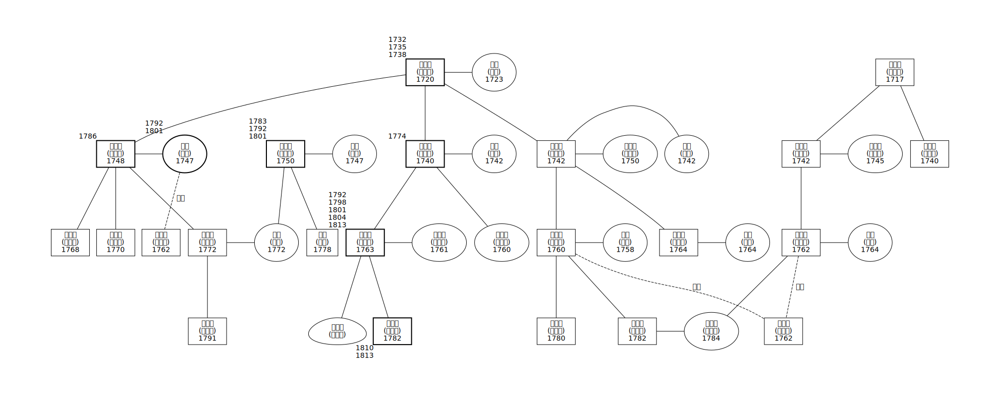

# poptree
Make family trees with Graphviz (on python)
  
### To execute:
```
pip install git+https://github.com/acheul/poptree.git<br>
from pop_tree import *
```  

### details
* What you need is a tidily organized pandas dataframe, which has information on linkages between wife-husband and child-father.
* The dataframe should have following columns.  
  
|id|name|birth_year|sex|det|bold|xlabel|fa|hs|rl01_id|rl01_lab|rl02_id|rl02_lab|
|--|--|--|--|--|--|--|--|--|--|--|--|--|
|1|김조부\n(金造釜)|1720|1|"김조부는 신등면 사람으로, 조선시대 사람이다."|1|1732\n1735\n1738|NaN|NaN|NaN|NaN|NaN|NaN|  
  
> * *id* - Each person should have its own unique id.
> * *name* - This value will be the main label of the person.
> * *birth_year* - This value will be a part of the main label. If you don't want to reveal it, just left it Nan.
> * *sex* - Assign 1 for male, 2 for female and 3 for uncertain.
> * *det* - Describe some details on the person. This value will be indicated with a *mouse hover*. If you don't assign this value, the *name* value will be used as a mouse hover label.
> * *bold* - If you wand to make *style: bold* for the person's node, assign value 1.
> * *xlabel* - This value will be the sub-label, marked outside of a node.
> * *fa* - Assign *id* of the father of the person.
> * *hs* - Assign *id* of the husband of the person.
> * *rl01_id* - If you wand to indicate different relationship then *fa* or *hs*, assign the *id* of that relationship. This value must be paired with *rl01_lab*
> * *rl01_lab* - Assign the name of the relationship in *rl01_id*
> * *rl02_id*, *rl02_lab* - They are same as *rl01_id*, *rl01_lab*  
  
* You can reassign keyword arguments:
> * *format* of the Graph, *graph_name*, *graph_attr*, *node_attr*, *edge_attr*
> * You can transform the *Shape* dictionary, which links sex(1, 2, 3) and the shape of node. Currently it's "Shape={1:'box', 2:'ellipse', 3:'egg'}"
> * Also you can transform *Bold* dictionary, which links bold(1, 0) and the style of node. On default it is "Bold={0:'solid', 1:'bold'}"
> * If you designate "use_rllab=False", the *rl01* and *rl02* relationship will not be marked on the graph. "True" is the default.
> * If you designate "use_bold=False", the *bold* columns will not work on the graph. "True" is the default.

* The *Tree* function returns a Graph object. If you want to render and save it, you have to execute that process outside of the function. For example,
```
dot = Tree(df=dft, use_rllab=True) # Tree function works.
dot.render('tree', view=True) # render and save it as 'tree'. (defualt format is .svg)
display(dot) # To display it right away.
```
  
### Notes
* I higly recommend to work on Google Colab, which have graphviz installed from the first. Otherwise, it would be quite picky to install and use graphviz.  
* Designing this pack was initially inspired from a work of Ahsen Parwez https://medium.com/@ahsenparwez/building-a-family-tree-with-python-and-graphviz-e4afb8367316
* The main purpose for this pack is to restore and visualize family geneologies from premodern historic data. This is why the family tree here are mainly structured on paternal linkage, that is, on wife-husband and father-child connections.
* In the latest version, graphviz distinguishes *cluster* and *subgraph*. I got this point thanks to a StackFlow Q&A, https://stackoverflow.com/questions/55561635/problem-with-rank-same-in-subgraphs-and-clusters
  
### Examples
* From this table ...  
|    |   id | name     |   birth_year |   sex | det                                                 |   bold | xlabel                       |   fa |   hs |   rl01_id | rl01_lab   |   rl02_id | rl02_lab   |
|---:|-----:|:---------|-------------:|------:|:----------------------------------------------------|-------:|:-----------------------------|-----:|-----:|----------:|:-----------|----------:|:-----------|
|  0 |    1 | 김조부   |         1720 |     1 | "김조부는 신등면 사람으로, 조선시대 사람이다."      |      1 | 1732\n1735\n1738             |  nan |  nan |       nan | nan        |       nan | nan        |
|    |      | (金造釜) |              |       |                                                     |        |                              |      |      |           |            |           |            |
|  1 |    2 | 박씨     |         1723 |     2 | "박씨는 김조부의 부인으로, 조선시대 사람이다."      |    nan | nan                          |  nan |    1 |       nan | nan        |       nan | nan        |
|    |      | (朴氏)   |              |       |                                                     |        |                              |      |      |           |            |           |            |
|  2 |    3 | 김조일   |         1740 |     1 | "김조일은 김조부와 박씨의 자로, 조선시대 사람이다." |      1 | 1774                         |    1 |  nan |       nan | nan        |       nan | nan        |
|    |      | (金照一) |              |       |                                                     |        |                              |      |      |           |            |           |            |
|  3 |    4 | 이씨     |         1742 |     2 | nan                                                 |    nan | nan                          |  nan |    3 |       nan | nan        |       nan | nan        |
|    |      | (李氏)   |              |       |                                                     |        |                              |      |      |           |            |           |            |
|  4 |    5 | 김조이   |         1742 |     1 | nan                                                 |    nan | nan                          |    1 |  nan |       nan | nan        |       nan | nan        |
|    |      | (金照二) |              |       |                                                     |        |                              |      |      |           |            |           |            |
|  5 |    6 | 김성     |         1742 |     2 | nan                                                 |    nan | nan                          |  nan |    5 |       nan | nan        |       nan | nan        |
|    |      | (金姓)   |              |       |                                                     |        |                              |      |      |           |            |           |            |
|  6 |    7 | 박소사   |         1750 |     2 | nan                                                 |    nan | nan                          |  nan |    5 |       nan | nan        |       nan | nan        |
|    |      | (朴召史) |              |       |                                                     |        |                              |      |      |           |            |           |            |
|  7 |    8 | 김조삼   |         1748 |     1 | nan                                                 |      1 | 1786                         |    1 |  nan |       nan | nan        |       nan | nan        |
|    |      | (金照三) |              |       |                                                     |        |                              |      |      |           |            |           |            |
|  8 |    9 | 강성     |         1747 |     2 | nan                                                 |      1 | 1792\n1801                   |  nan |    8 |       nan | nan        |       nan | nan        |
|    |      | (康姓)   |              |       |                                                     |        |                              |      |      |           |            |           |            |
|  9 |   10 | 김소사   |         1760 |     2 | nan                                                 |    nan | nan                          |    3 |  nan |       nan | nan        |       nan | nan        |
|    |      | (金召史) |              |       |                                                     |        |                              |      |      |           |            |           |            |
| 10 |   11 | 김부일   |         1763 |     1 | nan                                                 |      1 | 1792\n1798\n1801\n1804\n1813 |    3 |  nan |       nan | nan        |       nan | nan        |
|    |      | (金富一) |              |       |                                                     |        |                              |      |      |           |            |           |            |
| 11 |   12 | 김소사   |         1761 |     2 | nan                                                 |    nan | nan                          |  nan |   11 |       nan | nan        |       nan | nan        |
|    |      | (金召史) |              |       |                                                     |        |                              |      |      |           |            |           |            |
| 12 |   13 | 김아지   |          nan |   nan | nan                                                 |    nan | nan                          |   11 |  nan |       nan | nan        |       nan | nan        |
|    |      | (金兒只) |              |       |                                                     |        |                              |      |      |           |            |           |            |
| 13 |   14 | 김구일   |         1782 |     1 | nan                                                 |      1 | 1810\n1813                   |   11 |  nan |       nan | nan        |       nan | nan        |
|    |      | (金具一) |              |       |                                                     |        |                              |      |      |           |            |           |            |
| 14 |   15 | 김부이   |         1760 |     1 | nan                                                 |    nan | nan                          |    5 |  nan |       nan | nan        |       nan | nan        |
|    |      | (金富二) |              |       |                                                     |        |                              |      |      |           |            |           |            |
| 15 |   16 | 진씨     |         1758 |     2 | nan                                                 |    nan | nan                          |  nan |   15 |       nan | nan        |       nan | nan        |
|    |      | (陳氏)   |              |       |                                                     |        |                              |      |      |           |            |           |            |
| 16 |   17 | 김부삼   |         1764 |     1 | nan                                                 |    nan | nan                          |    5 |  nan |       nan | nan        |       nan | nan        |
|    |      | (金富三) |              |       |                                                     |        |                              |      |      |           |            |           |            |
| 17 |   18 | 박씨     |         1764 |     2 | nan                                                 |    nan | nan                          |  nan |   17 |       nan | nan        |       nan | nan        |
|    |      | (朴氏)   |              |       |                                                     |        |                              |      |      |           |            |           |            |
| 18 |   19 | 김구이   |         1780 |     1 | nan                                                 |    nan | nan                          |   15 |  nan |       nan | nan        |       nan | nan        |
|    |      | (金具二) |              |       |                                                     |        |                              |      |      |           |            |           |            |
| 19 |   20 | 김구삼   |         1782 |     1 | nan                                                 |    nan | nan                          |   15 |  nan |       nan | nan        |       nan | nan        |
|    |      | (金具三) |              |       |                                                     |        |                              |      |      |           |            |           |            |
| 20 |   21 | 김부사   |         1768 |     1 | nan                                                 |    nan | nan                          |    8 |  nan |       nan | nan        |       nan | nan        |
|    |      | (金富四) |              |       |                                                     |        |                              |      |      |           |            |           |            |
| 21 |   22 | 김부오   |         1770 |     1 | nan                                                 |    nan | nan                          |    8 |  nan |       nan | nan        |       nan | nan        |
|    |      | (金富五) |              |       |                                                     |        |                              |      |      |           |            |           |            |
| 22 |   23 | 김부륙   |         1772 |     1 | nan                                                 |    nan | nan                          |    8 |  nan |       nan | nan        |       nan | nan        |
|    |      | (金富六) |              |       |                                                     |        |                              |      |      |           |            |           |            |
| 23 |   24 | 박씨     |         1772 |     2 | nan                                                 |    nan | nan                          |   26 |   23 |       nan | nan        |       nan | nan        |
|    |      | (朴氏)   |              |       |                                                     |        |                              |      |      |           |            |           |            |
| 24 |   25 | 김구성   |         1791 |     1 | nan                                                 |    nan | nan                          |   23 |  nan |       nan | nan        |       nan | nan        |
|    |      | (金具晟) |              |       |                                                     |        |                              |      |      |           |            |           |            |
| 25 |   26 | 박주일   |         1750 |     1 | nan                                                 |      1 | 1783\n1792\n1801             |  nan |  nan |       nan | nan        |       nan | nan        |
|    |      | (朴周一) |              |       |                                                     |        |                              |      |      |           |            |           |            |
| 26 |   27 | 유씨     |         1747 |     2 | nan                                                 |    nan | nan                          |  nan |   26 |       nan | nan        |       nan | nan        |
|    |      | (柳氏)   |              |       |                                                     |        |                              |      |      |           |            |           |            |
| 27 |   28 | 이증일   |         1717 |     1 | nan                                                 |    nan | nan                          |  nan |  nan |       nan | nan        |       nan | nan        |
|    |      | (李曾一) |              |       |                                                     |        |                              |      |      |           |            |           |            |
| 28 |   29 | 이조일   |         1742 |     1 | nan                                                 |    nan | nan                          |   28 |  nan |       nan | nan        |       nan | nan        |
|    |      | (李藻一) |              |       |                                                     |        |                              |      |      |           |            |           |            |
| 29 |   30 | 강소사   |         1745 |     2 | nan                                                 |    nan | nan                          |  nan |   29 |       nan | nan        |       nan | nan        |
|    |      | (姜召史) |              |       |                                                     |        |                              |      |      |           |            |           |            |
| 30 |   31 | 이조이   |         1740 |     1 | nan                                                 |    nan | nan                          |   28 |  nan |       nan | nan        |       nan | nan        |
|    |      | (李藻二) |              |       |                                                     |        |                              |      |      |           |            |           |            |
| 31 |   32 | 이주일   |         1762 |     1 | nan                                                 |    nan | nan                          |   29 |  nan |       nan | nan        |       nan | nan        |
|    |      | (李珠一) |              |       |                                                     |        |                              |      |      |           |            |           |            |
| 32 |   33 | 소씨     |         1764 |     2 | nan                                                 |    nan | nan                          |  nan |   32 |       nan | nan        |       nan | nan        |
|    |      | (蘇氏)   |              |       |                                                     |        |                              |      |      |           |            |           |            |
| 33 |   34 | 이소사   |         1784 |     2 | nan                                                 |    nan | nan                          |   32 |   20 |       nan | nan        |       nan | nan        |
|    |      | (李召史) |              |       |                                                     |        |                              |      |      |           |            |           |            |
| 34 |   35 | 박참     |         1778 |     1 | nan                                                 |    nan | nan                          |   26 |  nan |       nan | nan        |       nan | nan        |
|    |      | (朴參)   |              |       |                                                     |        |                              |      |      |           |            |           |            |
| 35 |   36 | 강유의   |         1762 |     1 | nan                                                 |    nan | nan                          |  nan |  nan |         9 | 사촌       |       nan | nan        |
|    |      | (康有爲) |              |       |                                                     |        |                              |      |      |           |            |           |            |
| 36 |   37 | 김사촌   |         1762 |     1 | nan                                                 |    nan | nan                          |  nan |  nan |        15 | 사촌       |        32 | 친구       |
|    |      | (金四寸) |              |       |                                                     |        |                              |      |      |           |            |           |            |
  
* Below svg file rendered.

